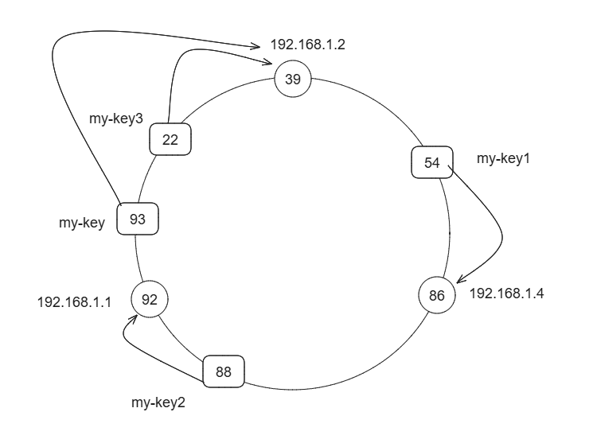
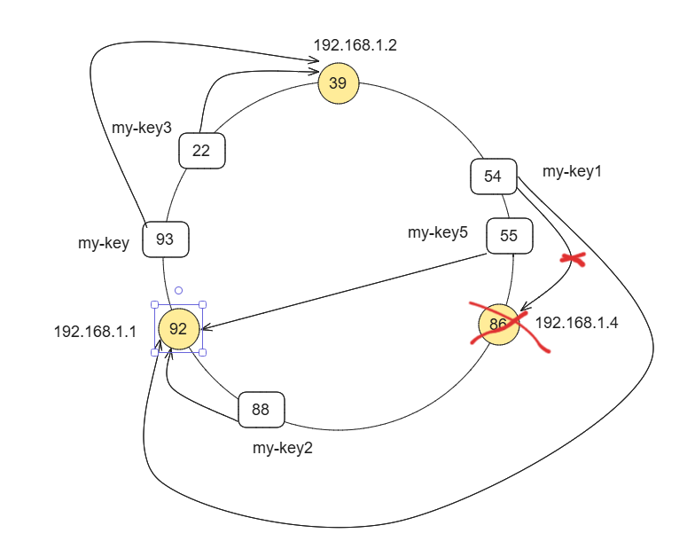

# Consistent hashing

## Add node and add key

## Delete a node

After delete a node all key inside that node is moved to next node. And all added node after will route normally

### Log

PS F:\GO_PROJECT\go-consistent-hashing> go run .\main.go

================================== Add Nodes ==========================================

Node  1  Ip =  192.168.1.2  position =  39

Node  2  Ip =  192.168.1.4  position =  86

Node  3  Ip =  192.168.1.1  position =  92

================================== Add keys ==========================================

Route key my-key, hash: 93 to begin node: 192.168.1.2

Key my-key1 is routed hash 54 to server: 192.168.1.4

Key my-key2 is routed hash 88 to server: 192.168.1.1

Key my-key3 is routed hash 22 to server: 192.168.1.2

================================= Print values in each node =========================================

value in server 192.168.1.1:  map[88:{nguyễn văn a 15}]

value in server 192.168.1.2:  map[22:highland 93:1]

value in server 192.168.1.4:  map[54:phúc long]

=================================== Remove a node 192.168.1.4 ====================================

distributeKeysOnRemovedNode 192.168.1.4 to next node 192.168.1.1Vlaue:  map[54:phúc long]

========================== add  key again after remove ===================================

========== Previous key ''my-key1' route to '192.168.1.4' ==========

========== After remove node key ''my-key1' route to '192.168.1.1' ==========

Key my-key5 is routed hash 59 to server: 192.168.1.1

value in server 192.168.1.1:  map[54:phúc long 59:The coffee house 88:{nguyễn văn a 15}]

value in server 192.168.1.2:  map[22:highland 93:1]

